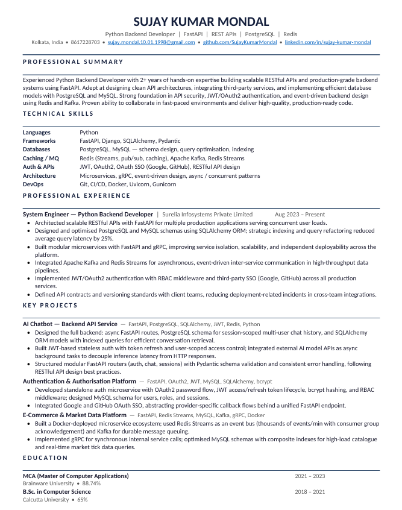

# 👋 Hi, I'm Sujay Kumar Mondal

💻 **System Engineer | Python Backend Developer | FastAPI Enthusiast**

I specialize in building **scalable backend systems**, **secure authentication platforms**, **REST APIs**, and **event-driven microservices** using modern Python technologies.

---

## 📄 Resume

  

  <a href="https://github.com/SujayKumarMondal/SujayKumarMondal/blob/main/Resume_2026.pdf">
    📖 View Resume
  </a>
  &nbsp;|&nbsp;
  <a href="https://github.com/SujayKumarMondal/SujayKumarMondal/raw/main/Resume_2026.pdf">
    ⬇️ Download Resume
  </a>

---

## 🚀 Portfolio

🌐 **Portfolio Website**

https://sujaykumarmondal.github.io/portfolio/

---

## 💼 Professional Experience

### 🏢 System Engineer

**Surelia Infosystems Private Limited**
📅 Aug 2023 – Present

* 2+ years of professional backend development experience
* Designing scalable REST APIs and microservices
* Building secure authentication and authorization systems
* Developing event-driven architectures using Kafka and Redis
* Optimizing PostgreSQL and MySQL databases for production workloads

---

## 🔥 Core Expertise

### Backend Development

* Python
* FastAPI
* Django
* SQLAlchemy
* Pydantic
* REST APIs

### Databases

* PostgreSQL
* MySQL
* Database Design
* Query Optimization
* Indexing

### Authentication & Security

* JWT Authentication
* OAuth2
* Google OAuth
* GitHub OAuth
* RBAC
* Session Management

### Messaging & Distributed Systems

* Apache Kafka
* Redis
* Redis Streams
* gRPC
* Event-Driven Architecture

### DevOps & Tools

* Docker
* Git
* CI/CD
* Linux
* Postman

---

## 🚀 Featured Projects

### 🤖 AI Chatbot Platform

**Tech Stack:** FastAPI, PostgreSQL, SQLAlchemy, JWT, Redis

* Multi-user chat system
* Secure JWT authentication
* Chat history management
* AI model integration
* Async API architecture

### 🔐 Authentication & Authorization Platform

**Tech Stack:** FastAPI, OAuth2, JWT, MySQL

* Access & Refresh Tokens
* RBAC Implementation
* Password Reset Flow
* Email Verification
* Google OAuth Integration
* GitHub OAuth Integration

### 📊 Event-Driven Microservices Platform

**Tech Stack:** FastAPI, Kafka, Redis Streams, gRPC, Docker

* Distributed microservices architecture
* Event streaming and asynchronous processing
* High-throughput message handling
* Internal service communication using gRPC
* Dockerized deployment

---

## 🛠️ Currently Working On

* 🚀 FastAPI-based AI Chatbot Platform
* 🔐 Authentication & Authorization Solutions
* 📡 Event-Driven Backend Systems

---

## 🚀 Tech Stack

---

## 📈 GitHub Stats

  

  

---

## 🔗 Connect With Me

💼 LinkedIn
https://www.linkedin.com/in/sujay-kumar-mondal-a125481b7/

📧 Email
[sujay.mondal.10.01.1998@gmail.com](mailto:sujay.mondal.10.01.1998@gmail.com)

🐙 GitHub
https://github.com/SujayKumarMondal

🌐 Portfolio
https://sujaykumarmondal.github.io/portfolio/

---

⭐ **"Building scalable backend systems one API at a time."**
